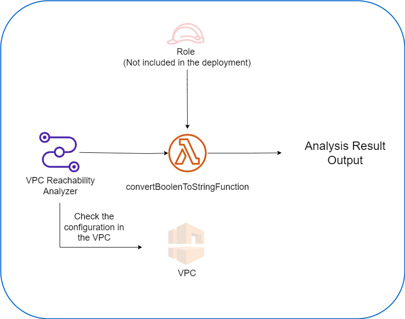

# AWS VPC REACHABILITY ANALYZER MODULE

## Overview
This module deploy the VPC Reachability analyzer feature.

The module asks for the source ID,destination ID, and port to find out if the connexion is valid.

With this module validatation of connectivity between resources can be included in the deployment phase.

This project has been developed for learning purposes.


## Architecture Diagram


## Architecture Consideations

### Cloudformation Custom Resources
Cloudformation does not natively support boolean outputs. For this reason it has been necessary to include a Lambda function that converts the boolean to string in order to generate the output.

Thanks to this implementation, I have learned to use Cloudformation's custom resources. This [post by Alex DeBrie](https://www.alexdebrie.com/posts/cloudformation-custom-resources/) helped me to learn how to use them.

## Usage
### Inputs

|Name|Description|Type|Default|Mandatory| 
|----|-----------|----|-------|---------|
|port|The port to be checked.If 0, then it will check all the ports return a true statement if the connection is valid in one of them.|`integer`|0|No|
|lambdaRoleArn|The role ARN to be attached to the lambda function.|`string`||Yes|
|sourceResourceID|The source Resouce ID.|`string`||Yes|
|destinationResourceID|The destination resource ID.|`string`||Yes|
|protocol|The protocol to be analyze. Allowed values are : ['tcp','udp'] |`string`||Yes|


### Outputs

|Name|Description|Type|
|----|-----------|----|
|NetworkInsightsPathArn|The NetworkInsights Path ARN.|`string`|
|NetworkInsightsPathID|The NetworkInsights Path ID.|`string`|
|NetworkInsightsAnalysisStartDate|The NetworkInsights Analysis Start Date.|`string`|
|NetworkInsightsAnalysisStatus|The status of the Analysis.|`string`|
|NetworkInsightsAnalysisPathFound|Indicates wheter the destination is reachable from the source.|`string`|


```hcl
# Must have programmatic access to AWS
git clone <REPOSITORY_URI>

cd <REPOSITORY_FOLDER>/cloudformation/

aws deploy --template-file vpcReachabilityAnalyzer.yaml --stack-name <STACK-NAME>
```
